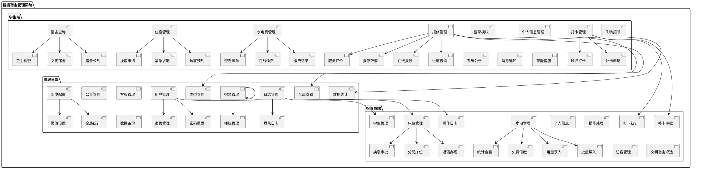
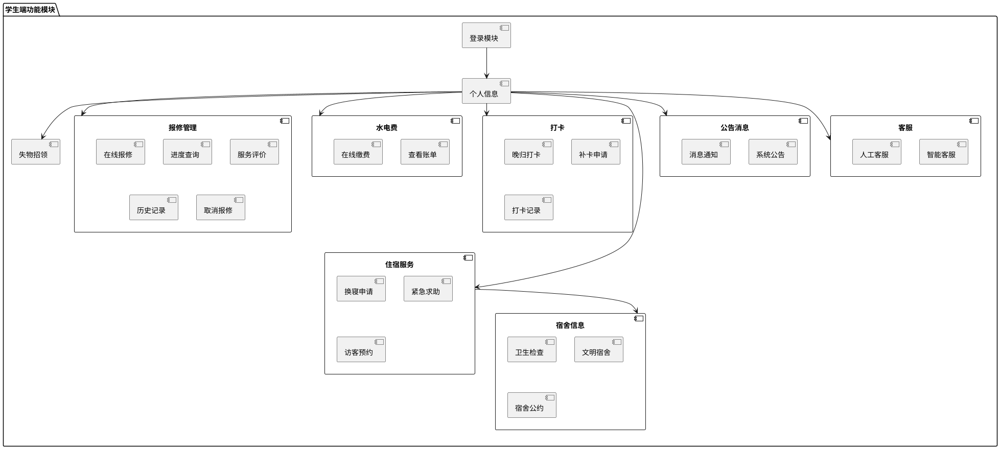
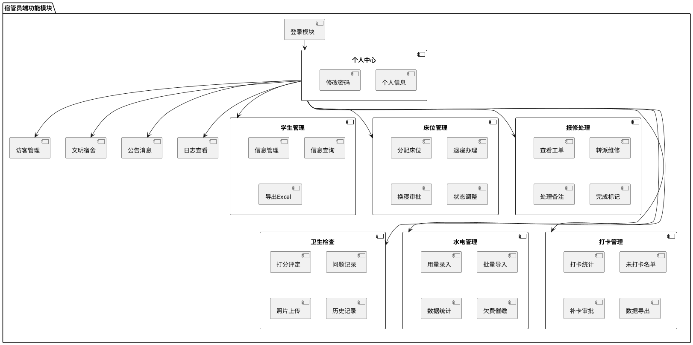
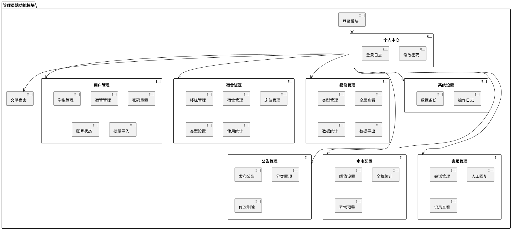
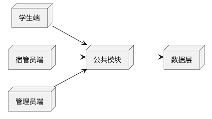

# 智能宿舍管理系统功能模块图

## 一、系统总体架构

```
┌─────────────────────────────────────────────────────────────────┐
│                      智能宿舍管理系统                              │
├─────────────────────────────────────────────────────────────────┤
│  ┌──────────────┐   ┌──────────────┐   ┌──────────────┐       │
│  │   学生端     │   │   宿管员端    │   │   管理员端    │       │
│  │  (Web/App)  │   │   (Web)      │   │   (Web)      │       │
│  └──────┬───────┘   └──────┬───────┘   └──────┬───────┘       │
│         │                   │                   │                │
│  ───────┴───────────────────┴───────────────────┴────────────  │
│                           │                                       │
│                    ┌──────▼──────┐                               │
│                    │  Spring Boot  │                             │
│                    │    后端服务    │                             │
│                    └──────┬──────┘                               │
│                           │                                       │
│                    ┌──────▼──────┐                               │
│                    │   MySQL 8.0   │                             │
│                    │    数据库      │                             │
│                    └───────────────┘                               │
└─────────────────────────────────────────────────────────────────┘
```

---

## 二、功能模块图（PlantUML代码）

### 1. 完整系统功能模块图



### 2. 学生端功能模块图



### 3. 宿管员端功能模块图



### 4. 管理员端功能模块图



---

## 三、功能模块说明

### 1. 学生端模块

| 一级模块 | 二级模块 | 功能描述 |
|---------|---------|---------|
| 登录模块 | 登录 | 学号密码登录，JWT认证 |
| 个人信息 | 个人信息 | 查看/修改个人信息，查看宿舍床位 |
| 报修管理 | 在线报修 | 选择类型、描述、上传照片提交 |
| 报修管理 | 进度查询 | 查看处理状态 |
| 报修管理 | 服务评价 | 满意度打分 |
| 水电费 | 查看账单 | 本月用量和费用 |
| 水电费 | 在线缴费 | 二维码支付 |
| 打卡 | 晚归打卡 | 22:00-23:00打卡 |
| 打卡 | 补卡申请 | 逾期补卡 |
| 住宿服务 | 换寝申请 | 楼内换寝 |
| 住宿服务 | 紧急求助 | 一键求助 |
| 住宿服务 | 访客预约 | 预约访客 |
| 宿舍信息 | 卫生检查 | 查看检查结果 |
| 宿舍信息 | 文明宿舍 | 查看排行榜 |
| 失物招领 | 失物招领 | 发布/查看失物 |
| 公告消息 | 系统公告 | 查看公告 |
| 客服 | 智能客服 | AI问答 |

### 2. 宿管员端模块

| 一级模块 | 二级模块 | 功能描述 |
|---------|---------|---------|
| 登录模块 | 登录 | 账号密码登录 |
| 学生管理 | 学生管理 | 增删改查、导出Excel |
| 床位管理 | 分配管理 | 分配床位、批量分配 |
| 床位管理 | 退寝办理 | 退寝手续、资产清点 |
| 床位管理 | 换寝审批 | 审批换寝申请 |
| 报修处理 | 工单处理 | 接单、转派、填写备注 |
| 卫生检查 | 卫生打分 | 1-10分打分、拍照 |
| 访客管理 | 访客审批 | 审批预约申请 |
| 水电管理 | 用量录入 | 录入水电用量 |
| 水电管理 | 批量导入 | Excel导入 |
| 打卡管理 | 打卡统计 | 查看打卡率 |
| 打卡管理 | 补卡审批 | 审批补卡申请 |
| 文明宿舍 | 评选 | 月度文明宿舍评选 |

### 3. 管理员端模块

| 一级模块 | 二级模块 | 功能描述 |
|---------|---------|---------|
| 登录模块 | 登录 | 管理员账号登录 |
| 用户管理 | 学生管理 | 增删改查、批量导入 |
| 用户管理 | 宿管管理 | 增删改查 |
| 宿舍资源 | 楼栋管理 | 宿舍楼CRUD |
| 宿舍资源 | 床位管理 | 床位状态管理 |
| 报修管理 | 类型管理 | 报修类型CRUD |
| 公告管理 | 发布公告 | 公告CRUD、置顶 |
| 水电配置 | 阈值设置 | 设置用量阈值 |
| 客服管理 | 会话管理 | 人工客服回复 |
| 日志管理 | 操作日志 | 查看操作记录 |

---

## 四、模块依赖关系



---

## 五、PlantUML使用说明

### 1. 在线工具
- 访问 https://www.plantuml.com/plantuml/uml
- 复制上述代码粘贴到编辑器
- 点击 "Submit" 生成模块图
- 右键保存为图片

### 2. VS Code插件
- 安装 "PlantUML" 插件
- 创建 `.puml` 文件
- 右键选择 "Preview"

### 3. Draw.io导入
- 打开 draw.io
- 选择 "文件" → "导入" → "从文件"
- 选择 `.puml` 文件导入
