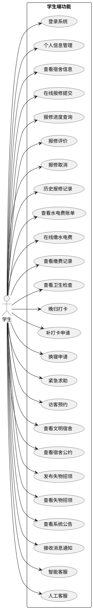
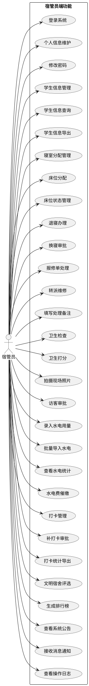
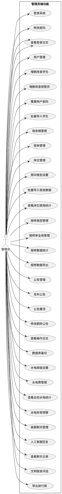

# 智能宿舍管理系统用例图

## 一、系统角色

| 角色 | 说明 |
|------|------|
| **学生** | 宿舍居住人员，使用学生端系统 |
| **宿管员** | 宿舍楼管理人员，使用宿管员端系统 |
| **管理员** | 系统最高管理员，使用管理员端系统 |

---

## 二、用例图（PlantUML代码）

### 1. 学生用例图

### 2. 宿管员用例图

### 3. 管理员用例图

---

## 三、完整用例图（总览）

```plantuml
@startuml
left to right direction

actor "学生" as Student #A8D5BA
actor "宿管员" as Manager #F4D03F
actor "管理员" as Admin #E74C3C

rectangle "智能宿舍管理系统" {
    
    ' ========== 登录模块 ==========
    Student --> (登录/注册)
    Manager --> (登录系统)
    Admin --> (登录系统)
    
    ' ========== 个人信息 ==========
    Student --> (个人信息管理)
    Student --> (查看宿舍信息)
    Manager --> (个人信息维护)
    Admin --> (修改密码)
    
    ' ========== 报修模块 ==========
    Student --> (在线报修提交)
    Student --> (报修进度查询)
    Student --> (报修评价)
    Student --> (报修取消)
    Manager --> (报修单处理)
    Manager --> (转派维修)
    Admin --> (报修类型管理)
    Admin --> (报修单全局管理)
    
    ' ========== 水电费模块 ==========
    Student --> (查看水电费账单)
    Student --> (在线缴水电费)
    Manager --> (录入水电用量)
    Manager --> (批量导入水电)
    Manager --> (查看水电统计)
    Admin --> (水电阈值设置)
    Admin --> (查看全校水电统计)
    
    ' ========== 住宿管理 ==========
    Manager --> (学生信息管理)
    Manager --> (寝室分配)
    Manager --> (床位管理)
    Manager --> (退寝办理)
    Student --> (换寝申请)
    Manager --> (换寝审批)
    
    ' ========== 卫生检查 ==========
    Manager --> (卫生检查)
    Student --> (查看卫生检查)
    Manager --> (文明宿舍评选)
    Student --> (查看文明宿舍)
    Admin --> (文明宿舍评选管理)
    
    ' ========== 打卡模块 ==========
    Student --> (晚归打卡)
    Student --> (补打卡申请)
    Manager --> (打卡管理)
    Manager --> (补打卡审批)
    
    ' ========== 访客模块 ==========
    Student --> (访客预约)
    Manager --> (访客审批)
    
    ' ========== 紧急求助 ==========
    Student --> (紧急求助)
    Manager --> (接收紧急求助)
    
    ' ========== 通知公告 ==========
    Student --> (查看系统公告)
    Manager --> (查看系统公告)
    Admin --> (发布系统公告)
    
    ' ========== 消息通知 ==========
    Student --> (接收消息通知)
    Manager --> (接收消息通知)
    Admin --> (接收消息通知)
    
    ' ========== 失物招领 ==========
    Student --> (发布失物招领)
    Student --> (查看失物招领)
    
    ' ========== 客服模块 ==========
    Student --> (智能客服)
    Student --> (人工客服)
    Admin --> (客服聊天管理)
    
    ' ========== 宿管模块 ==========
    Manager --> (修改密码)
    Admin --> (用户管理)
    Admin --> (宿舍楼管理)
    Admin --> (日志管理)
}
@enduml
```

---

## 四、用例说明表

### 1. 学生用例

| 用例编号 | 用例名称 | 用例描述 |
|---------|---------|---------|
| UC-001 | 登录系统 | 使用学号和密码登录系统 |
| UC-002 | 个人信息管理 | 查看和修改个人信息 |
| UC-003 | 在线报修提交 | 提交报修单，选择类型、描述问题、上传照片 |
| UC-004 | 报修进度查询 | 查看报修单处理状态 |
| UC-005 | 报修评价 | 对完成的报修服务进行评价 |
| UC-006 | 查看水电费 | 查看本月水电用量和费用 |
| UC-007 | 在线缴费 | 通过二维码支付水电费 |
| UC-008 | 晚归打卡 | 每日22:00-23:00进行打卡 |
| UC-009 | 换寝申请 | 申请楼内换寝 |
| UC-010 | 紧急求助 | 发起紧急求助警报 |
| UC-011 | 访客预约 | 预约访客到访 |
| UC-012 | 查看公告 | 查看系统发布的公告 |
| UC-013 | 智能客服 | 与AI客服对话解决问题 |
| UC-014 | 失物招领 | 发布和查看失物招领信息 |

### 2. 宿管员用例

| 用例编号 | 用例名称 | 用例描述 |
|---------|---------|---------|
| UC-101 | 登录系统 | 使用账号密码登录 |
| UC-102 | 学生管理 | 查看和管理本楼学生信息 |
| UC-103 | 床位分配 | 为学生分配宿舍床位 |
| UC-104 | 退寝办理 | 办理学生退寝手续 |
| UC-105 | 换寝审批 | 审批学生的换寝申请 |
| UC-106 | 报修处理 | 处理学生的报修申请 |
| UC-107 | 卫生检查 | 对宿舍进行卫生检查打分 |
| UC-108 | 访客审批 | 审批学生的访客预约 |
| UC-109 | 水电录入 | 录入宿舍水电用量 |
| UC-110 | 打卡管理 | 查看和管理学生打卡情况 |
| UC-111 | 补卡审批 | 审批学生的补打卡申请 |
| UC-112 | 文明宿舍评选 | 评选月度文明宿舍 |
| UC-113 | 查看公告 | 查看系统公告 |

### 3. 管理员用例

| 用例编号 | 用例名称 | 用例描述 |
|---------|---------|---------|
| UC-201 | 登录系统 | 使用管理员账号登录 |
| UC-202 | 用户管理 | 增删改查学生和宿管员 |
| UC-203 | 宿舍管理 | 管理宿舍楼、宿舍、床位 |
| UC-204 | 报修类型管理 | 管理报修类型 |
| UC-205 | 公告管理 | 发布和管理系统公告 |
| UC-206 | 水电阈值设置 | 设置水电用量阈值 |
| UC-207 | 客服管理 | 管理人工客服会话 |
| UC-208 | 日志管理 | 查看登录和操作日志 |
| UC-209 | 数据导出 | 导出各类数据到Excel |

---

## 五、PlantUML使用说明

### 1. 在线工具
- 访问 https://www.plantuml.com/plantuml/uml
- 复制上述代码粘贴到编辑器
- 点击 "Submit" 生成用例图
- 右键保存为图片

### 2. VS Code插件
- 安装 "PlantUML" 插件
- 创建 `.puml` 文件
- 右键选择 "Preview"

### 3. Draw.io导入
- 打开 draw.io
- 选择 "文件" → "导入" → "从文件"
- 选择 `.puml` 文件导入
